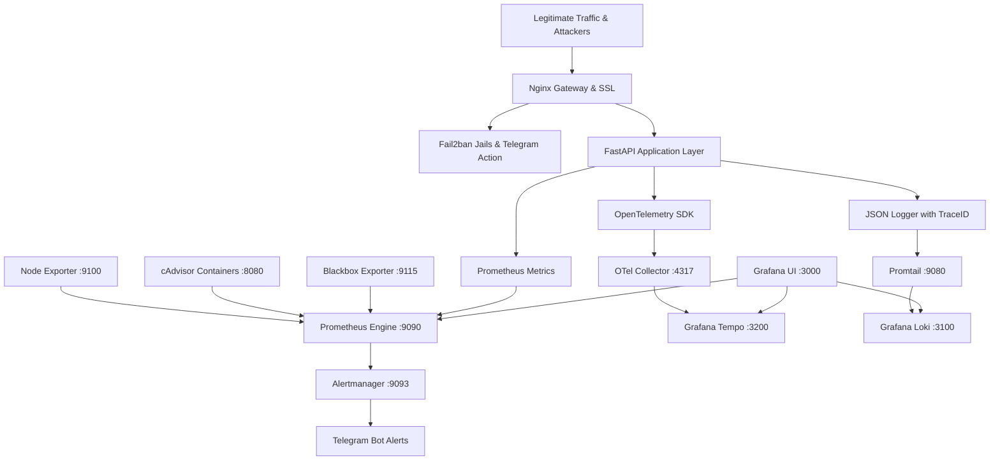

```text
    _   __          __  ___                  
   / | / /__  _  __/ /_/   | __  ___________ _
  /  |/ / _ \| |/_/ __/ /| |/ / / / ___/ __ `/
 / /|  /  __/>  </ /_/ ___ / /_/ / /  / /_/ / 
/_/ |_/\___/_/|_|\__/_/  |_\__,_/_/   \__,_/  

      ⚡ VPS OBSERVABILITY & SECURITY PLATFORM ⚡
```

# NextAura VPS Monitoring System 🛡️📊

An enterprise-grade, turn-key observability and proactive security platform designed for Linux VPS nodes, Docker containers, and microservices. Combining the power of **Datadog APM + AWS CloudWatch + New Relic + Fail2ban Security** into a self-hosted, resource-efficient, and secure cloud-native architecture.

---

## 🌟 Platform Highlights

- 🖥️ **Infrastructure Observability**: Host CPU, RAM, Disk I/O, Network Throughput, System Load, and Docker container lifecycles via **Prometheus**, **Node Exporter**, and **cAdvisor**.
- 🚀 **FastAPI APM & Golden Signals**: Production telemetry with **OpenTelemetry SDK** (W3C trace context, spans) and **Prometheus client** tracking RPS, Latency percentiles (p50/p90/p95/p99), 4xx/5xx error rates, database query timing, and external API latency.
- 📊 **Business Analytics & Usage KPIs**: Real-time concurrent active users by subscription tier, daily signups, login success/failure ratio, token consumption per client, and gross revenue metrics.
- 🛡️ **Fail2ban & Edge Security**: Nginx reverse proxy with rate limiting, Fail2ban jails for brute-force login attacks, 429 abusers, and 404 vulnerability scanner bots with **instant Telegram ban notifications**.
- 📜 **Unified Logs & Traces**: **Grafana Loki** + **Promtail** structured JSON logging correlated with **Grafana Tempo** distributed traces via clickable `TraceID` links.
- 📲 **1-Step Telegram Alerting**: Instant alerting requiring **only your Bot Token from @BotFather** (auto-discovers bot username & Chat ID).
- 🔍 **Host Service & Nginx Discovery Scanner**: Auto-scans host ports, identifies existing Nginx/Apache/Databases, and prevents port collisions.
- 🌐 **Automated Nginx Site Generator**: Creates production reverse-proxy configs for custom user apps (Node, React, Python, Go, PHP).
- 🎛️ **5 Pre-Provisioned Grafana Dashboards**: Ready out-of-the-box with dark-mode aesthetic styling.

---

## 🏗️ Architecture Pipeline



---

## 📋 Comprehensive Usage Tables

### 1. 🛠️ CLI Management Commands (`Makefile`)

| Command | Underlying Script | Description & Purpose |
| :--- | :--- | :--- |
| **`make install`** | `bash install.sh` | **1-Click Universal Installer**: Auto-detects OS, installs Docker/Compose/Tools, scans ports, and launches. |
| **`make prereqs`** | `bash scripts/install_prereqs.sh` | **OS & Dependency Engine**: Detects Linux Distro (Ubuntu, Debian, RHEL, Arch, Alpine, SUSE) & installs prerequisites. |
| **`make menu`** | `python3 scripts/control_center.py` | **Master Control Center**: All-in-one interactive menu to manage, scan, scale, test, and monitor. |
| **`make wizard`** | `python3 scripts/wizard.py` | **Interactive Setup Wizard**: Guided questionnaire to scan ports, configure Telegram, VPS specs, and deploy. |
| **`make scan`** | `python3 scripts/scanner.py` | **Host Discovery Scanner**: Detects pre-existing Nginx, running sites, open ports, and databases. |
| **`make monitor-api`** | `python3 scripts/monitor_api.py` | **Zero-Touch API Monitor**: Monitors existing API domains & metrics without touching your configs. |
| **`make add-site`** | `python3 scripts/nginx_site_generator.py` | **Custom Nginx Site**: Auto-generates Nginx reverse proxy configs for your custom frontend/backend apps. |
| **`make telegram`** | `python3 scripts/telegram_setup.py` | **1-Step Telegram Setup**: Auto-detects Chat ID from Bot Token and configures Alertmanager. |
| **`make scale-node`**| `python3 scripts/scale_node.py` | **Remote VPS Scaling**: Connects via SSH to remote VPS and registers it for multi-node monitoring. |
| **`make up`** | `docker-compose up -d --build` | **Start Platform**: Builds and starts all 11 observability and security containers. |
| **`make down`** | `docker-compose down` | **Stop Platform**: Gracefully shuts down all containers. |
| **`make restart`** | `docker-compose restart` | **Restart Platform**: Restarts all services without rebuilding. |
| **`make status`** | `docker-compose ps` | **Status Check**: Displays status and healthcheck results of all containers. |
| **`make logs`** | `docker-compose logs -f --tail=100` | **Live Logs**: Streams real-time logs from all services. |
| **`make healthcheck`**| `bash scripts/healthcheck.sh` | **Diagnostic Health Probe**: Validates all 10 HTTP endpoints, scrape targets, and data stores. |
| **`make test-load`** | `python3 scripts/load_test.py` | **Traffic Benchmark**: Generates synthetic workloads, latency spikes, and security attack simulations. |
| **`make test-alert`**| `bash scripts/test_alert.sh` | **Alert Test**: Dispatches a test firing alert to Alertmanager to verify Telegram delivery. |
| **`make clean`** | `docker-compose down -v` | **Full Reset**: Stops stack and wipes all persistent TSDB, log, and trace volumes. |

---

### 2. 🌐 Web Interfaces & Access Endpoints

| Service | Public / Local URL | Default Credentials | Description / Access Scope |
| :--- | :--- | :--- | :--- |
| **Grafana UI** | `http://YOUR_VPS_IP:3000` | `admin` / `.env` password | **Main Visualization**: 5 pre-provisioned dark-mode dashboards. |
| **Nginx Reverse Proxy** | `http://YOUR_VPS_IP:80` | None | **Edge Gateway**: Rate-limiting, SSL termination, and routing. |
| **FastAPI App** | `http://YOUR_VPS_IP:8000` | None | **APM Demo Service**: Telemetry-instrumented API with sample routes. |
| **FastAPI Swagger Docs** | `http://YOUR_VPS_IP:8000/docs` | None | **Interactive API UI**: Endpoint testing & OpenAPI schema. |
| **Prometheus Metrics** | `http://127.0.0.1:9090` | Protected (Private) | **Core TSDB**: Scrapes targets, evaluates alerts & recording rules. |
| **Alertmanager UI** | `http://127.0.0.1:9093` | Protected (Private) | **Alerting Engine**: Deduplication, grouping, and Telegram dispatch. |
| **Loki Log Server** | `http://127.0.0.1:3100` | Private | **Log Engine**: TSDB log aggregation with 30-day compactor retention. |
| **Tempo Trace Server** | `http://127.0.0.1:3200` | Private | **Tracing Backend**: Distributed trace waterfall & TraceQL engine. |

---

### 3. 📊 Pre-Provisioned Grafana Dashboards

| Dashboard Title | Dashboard UID | Monitored Metrics & Panels |
| :--- | :--- | :--- |
| **1. Infrastructure & VPS Health Overview** | `infra-overview-v1` | Host CPU (User/System/IOWait), RAM breakdown, Root Disk usage, Disk IOPS, Network In/Out, Load Average (1m/5m/15m), and Docker Container resource gauges. |
| **2. FastAPI APM & API Performance** | `api-apm-performance-v1` | Total RPS, Status Codes (2xx/4xx/5xx), p50/p90/p95/p99 Latency curves, Top slowest routes table, In-flight requests, and Database query latency histogram. |
| **3. Business KPIs & Usage Analytics** | `business-analytics-v1` | Active users by plan tier, daily registrations, login success vs failure ratio, API token usage per client, feature consumption, and gross revenue. |
| **4. Security, Fail2ban & Abuse Monitoring** | `security-fail2ban-v1` | Total Banned IPs, Active Fail2ban jails, Brute-force login attempts timeline, 429 rate limit triggers, 404 vulnerability scanner probes, and live security event stream. |
| **5. Unified Logs & Distributed Tracing** | `logs-traces-explorer-v1` | Live Loki application log stream with severity filters and clickable `TraceID` jump to Tempo trace waterfall execution graphs. |

---

### 4. 🚀 FastAPI Application & APM Endpoints

| Endpoint | Method | Purpose & Emitted Telemetry |
| :--- | :--- | :--- |
| `/health/live` | `GET` | **Liveness Probe**: Monitored by Blackbox Exporter (`probe_success`). |
| `/health/ready` | `GET` | **Readiness Probe**: Checks DB and cache dependencies. |
| `/metrics` | `GET` | **Prometheus Scrape Endpoint**: Outputs OpenMetrics format. |
| `/api/auth/login` | `POST` | **Authentication**: Records success/failure metrics; emits JSON logs for Fail2ban. |
| `/api/auth/register` | `POST` | **User Signups**: Increments user registration & active users gauges. |
| `/api/checkout` | `POST` | **Revenue**: Tracks order amount ($), currency, client token, and external Stripe span. |
| `/api/data` | `GET` | **Standard API**: Records DB `SELECT` query execution time and client token. |
| `/api/feature/{name}` | `GET` | **Feature Analytics**: Tracks consumption per feature name & subscription tier. |
| `/api/slow` | `GET` | **Latency Spike Chaos**: Configurable delay parameter for testing p95/p99 latency alerts. |
| `/api/error` | `GET` | **Error Rate Chaos**: Simulates 4xx/5xx errors to test error rate alerts & Loki error streams. |
| `/api/rate-limited` | `GET` | **Rate Limit Chaos**: Returns 429 Too Many Requests to test Nginx & Fail2ban limits. |
| `/api/threat-simulate` | `GET` | **Security Chaos**: Simulates SQLi / path traversal scans to trigger security alert rules. |

---

### 5. 🛡️ Fail2ban Security Jails Reference & Telegram Format

Fail2ban scans structured logs and automatically bans attackers while dispatching rich security notifications directly to Telegram:

```text
🚨 SECURITY ALERT (Fail2Ban)

━━━━━━━━━━━━━━━━━━
🖥 Server: vps-master-01
📍 Service: fastapi-auth
━━━━━━━━━━━━━━━━━━

🚫 Action Taken: BANNED
🌐 Source IP: 198.51.100.45
🌍 Geo: Los Angeles, United States - AS13335 Cloudflare

📊 Metrics:
- Failed Attempts: 5
- Banned Duration: 3600s

⏱ Timestamp: 2026-09-06 02:40:00 UTC

📄 Reason:
Brute-force authentication attack detected on protected login routes (/api/auth/login). Triggered after 5 consecutive failed attempts.

🔐 Status: IP has been blocked via iptables/nftables
━━━━━━━━━━━━━━━━━━
```

| Jail Name | Filter Configuration | Trigger Condition | Default Ban Action |
| :--- | :--- | :--- | :--- |
| **`[sshd]`** | `sshd.conf` | 3 failed SSH logins in 10 min | Bans IP for **24 Hours** via iptables + Telegram alert. |
| **`[fastapi-auth]`** | `fastapi-auth.conf` | 5 failed API logins in 10 min | Bans IP for **2 Hours** via iptables + Telegram alert. |
| **`[nginx-429]`** | `nginx-429.conf` | 10 rate-limit violations (429) in 5 min | Bans IP for **1 Hour** via iptables + Telegram alert. |
| **`[api-abuse]`** | `api-abuse.conf` | 3 scanner probes (`.env`, `.git`, `phpmyadmin`) | Bans IP for **24 Hours** via iptables + Telegram alert. |

---

### 6. 🚨 Alertmanager Alert Rules Reference & Telegram Format

When an infrastructure or application performance threshold is breached, Alertmanager dispatches the exact route, metric value, server, and severity:

```text
🚨 SYSTEM ALERT (NextAura APM)

━━━━━━━━━━━━━━━━━━
🖥 Server: fastapi-service
📍 Service: fastapi-app
🎯 Endpoint / Route: /api/checkout
━━━━━━━━━━━━━━━━━━

🔥 Alert Name: ApiHighP95Latency
⚡ Severity: 🔴 CRITICAL
🏷 Category: application

📊 Performance & Metrics:
Endpoint /api/checkout 95th percentile latency is 0.854s (Threshold: > 0.500s)

📄 Reason:
Endpoint latency p95 > 500ms (/api/checkout)

⏱ Timestamp: 2026-09-06 02:41:15 UTC
📖 Runbook: https://docs.local/runbooks/api-5xx-errors
━━━━━━━━━━━━━━━━━━
🌐 Dashboard: Open Grafana Dashboards
```


---

## 🚀 Quickstart Guide

### 1. Clone & Interactive Wizard
```bash
git clone git@github.com:YOUR_USERNAME/VPS_Monitoring.git
cd VPS_Monitoring

# Run guided setup (auto-installs Docker if missing, scans ports, and sets Telegram):
make wizard
```

### 2. Configure 1-Step Telegram Alerts
```bash
make telegram
# Enter your Bot Token from @BotFather -> press /start on Telegram -> Done!
```

### 3. Add Custom Nginx Service / Site
```bash
make add-site
# Follow prompts to auto-generate reverse proxy configs for Node, React, Python, or Go apps.
```

### 4. Run System Diagnostics & Load Benchmark
```bash
# Verify all endpoints and targets:
make healthcheck

# Generate 20s of realistic traffic, latency spikes, and attack simulations:
make test-load
```

---

## 📚 Architectural & Engineering Documentation

- 🏛️ [System Architecture & Data Flow](file:///home/bit/Projects/VPS_Monitoring/docs/ARCHITECTURE.md)
- 📈 [Scaling Roadmap (1 to 100+ VPS Nodes)](file:///home/bit/Projects/VPS_Monitoring/docs/SCALING_ROADMAP.md)
- 🛡️ [Security Hardening & UFW Firewall Guide](file:///home/bit/Projects/VPS_Monitoring/docs/SECURITY_GUIDE.md)
- 🚨 [Incident Response Runbooks & PromQL/LogQL Cheat Sheet](file:///home/bit/Projects/VPS_Monitoring/docs/RUNBOOK.md)
