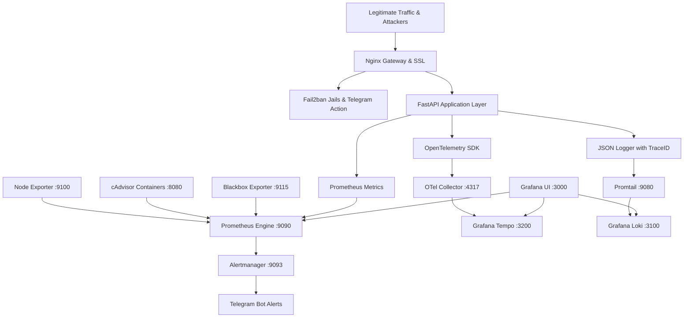

```text
    _   __          __  ___                  
   / | / /__  _  __/ /_/   | __  ___________ _
  /  |/ / _ \| |/_/ __/ /| |/ / / / ___/ __ `/
 / /|  /  __/>  </ /_/ ___ / /_/ / /  / /_/ / 
/_/ |_/\___/_/|_|\__/_/  |_\__,_/_/   \__,_/  

      ⚡ VPS OBSERVABILITY & SECURITY PLATFORM ⚡
```

# NextAura VPS Monitoring System 🛡️📊

An enterprise-grade, turn-key observability and proactive security platform designed for Linux VPS nodes, Docker containers, and microservices. Combining the power of **Datadog APM + AWS CloudWatch + New Relic + Fail2ban Security** into a self-hosted, resource-efficient, and secure cloud-native architecture.

---

## 🌟 Platform Highlights

- 🖥️ **Infrastructure Observability**: Host CPU, RAM, Disk I/O, Network Throughput, System Load, and Docker container lifecycles via **Prometheus**, **Node Exporter**, and **cAdvisor**.
- 🚀 **FastAPI APM & Golden Signals**: Production telemetry with **OpenTelemetry SDK** (W3C trace context, spans) and **Prometheus client** tracking RPS, Latency percentiles (p50/p90/p95/p99), 4xx/5xx error rates, database query timing, and external API latency.
- 📊 **Business Analytics & Usage KPIs**: Real-time concurrent active users by subscription tier, daily signups, login success/failure ratio, token consumption per client, and gross revenue metrics.
- 🛡️ **Fail2ban & Edge Security**: Nginx reverse proxy with rate limiting, Fail2ban jails for brute-force login attacks, 429 abusers, and 404 vulnerability scanner bots with **instant Telegram ban notifications**.
- 📜 **Unified Logs & Traces**: **Grafana Loki** + **Promtail** structured JSON logging correlated with **Grafana Tempo** distributed traces via clickable `TraceID` links.
- 📲 **1-Step Telegram Alerting**: Instant alerting requiring **only your Bot Token from @BotFather** (auto-discovers bot username & Chat ID).
- 🔍 **Host Service & Nginx Discovery Scanner**: Auto-scans host ports, identifies existing Nginx/Apache/Databases, and prevents port collisions.
- 🌐 **Automated Nginx Site Generator**: Creates production reverse-proxy configs for custom user apps (Node, React, Python, Go, PHP).
- 🎛️ **5 Pre-Provisioned Grafana Dashboards**: Ready out-of-the-box with dark-mode aesthetic styling.

---

## 🏗️ Architecture Pipeline



---

## 📋 Comprehensive Usage Tables

### 1. 🛠️ Unified CLI Management Commands (`./aura`)

| Command | Underlying Handler | Description & Purpose |
| :--- | :--- | :--- |
| **`./aura`** or **`./aura menu`** | `scripts/control_center.py` | **Master Control Center**: All-in-one interactive menu to manage, view, scan, scale, test, and purge. |
| **`./aura view`** | Built-in Multi-View Inspector | **Comprehensive Inspector**: Live view of registered Nginx projects, Docker containers, URLs, and hardware. |
| **`./aura up`** | `docker compose up -d --build` | **Start Platform**: Builds and starts all 11 observability and security microservices. |
| **`./aura down`** | `docker compose down` | **Stop Platform**: Gracefully shuts down all platform containers. |
| **`./aura restart`** | `docker compose restart` | **Restart Platform**: Restarts all containers without rebuilding. |
| **`./aura status`** | `docker compose ps` | **Status Check**: Displays status, healthcheck results, and listening ports. |
| **`./aura logs [svc]`** | `docker compose logs -f` | **Live Logs**: Streams real-time logs from all or specific services. |
| **`./aura health`** | `scripts/healthcheck.sh` | **Diagnostic Health Probe**: Validates all 10 HTTP endpoints, scrape targets, and data stores. |
| **`./aura nginx [cmd]`** | `nginx_engine/` | **Nginx DevOps Engine**: Full virtual host setup, Let's Encrypt SSL, IP SAN certs, and route additions. |
| **`./aura nginx list`** | `nginx_engine (SQLite)` | **List Nginx Projects**: Formatted table of registered projects with Project Codes (`SE-001`). |
| **`./aura scan`** | `scripts/scanner.py` | **Host Discovery Scanner**: Detects pre-existing Nginx, running sites, open ports, and databases. |
| **`./aura monitor-api`** | `scripts/monitor_api.py` | **Zero-Touch API Monitor**: Monitors existing API domains & metrics without touching your configs. |
| **`./aura telegram`** | `scripts/telegram_setup.py` | **1-Step Telegram Setup**: Auto-detects Chat ID from Bot Token and configures Alertmanager. |
| **`./aura scale-node`** | `scripts/scale_node.py` | **Remote VPS Scaling**: Onboard a remote Linux VPS worker node via SSH. |
| **`./aura test-load`** | `scripts/load_test.py` | **Traffic Benchmark**: Generates synthetic workloads, latency spikes, and security attack simulations. |
| **`./aura test-alert`**| `scripts/test_alert.sh` | **Alert Test**: Dispatches a test firing alert to Alertmanager to verify Telegram delivery. |
| **`./aura clean-disk`** | `scripts/auto_cleaner.sh` | **Automated Disk Cleaner**: Prunes 30-day expired TSDB blocks, log archives, Docker dangling layers, and journals. |
| **`./aura purge`** | Docker & Service Teardown | **Complete Deletion**: Stops and deletes all containers, wipes persistent volumes (`-v`), cleans caches. |
| **`./aura destroy -y`** | Force Teardown | **Non-Interactive Full Teardown**: Immediately purges all services and volumes. |

> [!NOTE]
> All commands can also be run with `make <target>` (e.g. `make view`, `make up`, `make down`, `make purge`) for seamless backward compatibility.

---

### 2. 🌐 Web Interfaces & Access Endpoints

| Service | Public / Local URL | Default Credentials | Description / Access Scope |
| :--- | :--- | :--- | :--- |
| **Grafana UI** | `http://YOUR_VPS_IP:3000` | `admin` / `.env` password | **Main Visualization**: 5 pre-provisioned dark-mode dashboards. |
| **Nginx Reverse Proxy** | `http://YOUR_VPS_IP:80` | None | **Edge Gateway**: Rate-limiting, SSL termination, and routing. |
| **FastAPI App** | `http://YOUR_VPS_IP:8000` | None | **APM Demo Service**: Telemetry-instrumented API with sample routes. |
| **FastAPI Swagger Docs** | `http://YOUR_VPS_IP:8000/docs` | None | **Interactive API UI**: Endpoint testing & OpenAPI schema. |
| **Prometheus Metrics** | `http://127.0.0.1:9090` | Protected (Private) | **Core TSDB**: Scrapes targets, evaluates alerts & recording rules. |
| **Alertmanager UI** | `http://127.0.0.1:9093` | Protected (Private) | **Alerting Engine**: Deduplication, grouping, and Telegram dispatch. |
| **Loki Log Server** | `http://127.0.0.1:3100` | Private | **Log Engine**: TSDB log aggregation with 30-day compactor retention. |
| **Tempo Trace Server** | `http://127.0.0.1:3200` | Private | **Tracing Backend**: Distributed trace waterfall & TraceQL engine. |

---

### 3. 📊 Pre-Provisioned Grafana Dashboards

| Dashboard Title | Dashboard UID | Monitored Metrics & Panels |
| :--- | :--- | :--- |
| **1. Infrastructure & VPS Health Overview** | `infra-overview-v1` | Host CPU (User/System/IOWait), RAM breakdown, Root Disk usage, Disk IOPS, Network In/Out, Load Average (1m/5m/15m), and Docker Container resource gauges. |
| **2. FastAPI APM & API Performance** | `api-apm-performance-v1` | Total RPS, Status Codes (2xx/4xx/5xx), p50/p90/p95/p99 Latency curves, Top slowest routes table, In-flight requests, and Database query latency histogram. |
| **3. Business KPIs & Usage Analytics** | `business-analytics-v1` | Active users by plan tier, daily registrations, login success vs failure ratio, API token usage per client, feature consumption, and gross revenue. |
| **4. Security, Fail2ban & Abuse Monitoring** | `security-fail2ban-v1` | Total Banned IPs, Active Fail2ban jails, Brute-force login attempts timeline, 429 rate limit triggers, 404 vulnerability scanner probes, and live security event stream. |
| **5. Unified Logs & Distributed Tracing** | `logs-traces-explorer-v1` | Live Loki application log stream with severity filters and clickable `TraceID` jump to Tempo trace waterfall execution graphs. |

---

### 4. 🚀 FastAPI Application & APM Endpoints

| Endpoint | Method | Purpose & Emitted Telemetry |
| :--- | :--- | :--- |
| `/health/live` | `GET` | **Liveness Probe**: Monitored by Blackbox Exporter (`probe_success`). |
| `/health/ready` | `GET` | **Readiness Probe**: Checks DB and cache dependencies. |
| `/metrics` | `GET` | **Prometheus Scrape Endpoint**: Outputs OpenMetrics format. |
| `/api/auth/login` | `POST` | **Authentication**: Records success/failure metrics; emits JSON logs for Fail2ban. |
| `/api/auth/register` | `POST` | **User Signups**: Increments user registration & active users gauges. |
| `/api/checkout` | `POST` | **Revenue**: Tracks order amount ($), currency, client token, and external Stripe span. |
| `/api/data` | `GET` | **Standard API**: Records DB `SELECT` query execution time and client token. |
| `/api/feature/{name}` | `GET` | **Feature Analytics**: Tracks consumption per feature name & subscription tier. |
| `/api/slow` | `GET` | **Latency Spike Chaos**: Configurable delay parameter for testing p95/p99 latency alerts. |
| `/api/error` | `GET` | **Error Rate Chaos**: Simulates 4xx/5xx errors to test error rate alerts & Loki error streams. |
| `/api/rate-limited` | `GET` | **Rate Limit Chaos**: Returns 429 Too Many Requests to test Nginx & Fail2ban limits. |
| `/api/threat-simulate` | `GET` | **Security Chaos**: Simulates SQLi / path traversal scans to trigger security alert rules. |

---

### 5. 🛡️ Fail2ban Security Jails Reference & Telegram Format

Fail2ban scans structured logs and automatically bans attackers while dispatching rich security notifications directly to Telegram:

```text
🚨 SECURITY ALERT (Fail2Ban)

━━━━━━━━━━━━━━━━━━
🖥 Server: vps-master-01
📍 Service: fastapi-auth
━━━━━━━━━━━━━━━━━━

🚫 Action Taken: BANNED
🌐 Source IP: 198.51.100.45
🌍 Geo: Los Angeles, United States - AS13335 Cloudflare

📊 Metrics:
- Failed Attempts: 5
- Banned Duration: 3600s

⏱ Timestamp: 2026-09-06 02:40:00 UTC

📄 Reason:
Brute-force authentication attack detected on protected login routes (/api/auth/login). Triggered after 5 consecutive failed attempts.

🔐 Status: IP has been blocked via iptables/nftables
━━━━━━━━━━━━━━━━━━
```

| Jail Name | Filter Configuration | Trigger Condition | Default Ban Action |
| :--- | :--- | :--- | :--- |
| **`[sshd]`** | `sshd.conf` | 3 failed SSH logins in 10 min | Bans IP for **24 Hours** via iptables + Telegram alert. |
| **`[fastapi-auth]`** | `fastapi-auth.conf` | 5 failed API logins in 10 min | Bans IP for **2 Hours** via iptables + Telegram alert. |
| **`[nginx-429]`** | `nginx-429.conf` | 10 rate-limit violations (429) in 5 min | Bans IP for **1 Hour** via iptables + Telegram alert. |
| **`[api-abuse]`** | `api-abuse.conf` | 3 scanner probes (`.env`, `.git`, `phpmyadmin`) | Bans IP for **24 Hours** via iptables + Telegram alert. |

---

### 6. 🚨 Alertmanager Alert Rules Reference & Telegram Format

When an infrastructure or application performance threshold is breached, Alertmanager dispatches the exact route, metric value, server, and severity:

```text
🚨 SYSTEM ALERT (NextAura APM)

━━━━━━━━━━━━━━━━━━
🖥 Server: fastapi-service
📍 Service: fastapi-app
🎯 Endpoint / Route: /api/checkout
━━━━━━━━━━━━━━━━━━

🔥 Alert Name: ApiHighP95Latency
⚡ Severity: 🔴 CRITICAL
🏷 Category: application

📊 Performance & Metrics:
Endpoint /api/checkout 95th percentile latency is 0.854s (Threshold: > 0.500s)

📄 Reason:
Endpoint latency p95 > 500ms (/api/checkout)

⏱ Timestamp: 2026-09-06 02:41:15 UTC
📖 Runbook: https://docs.local/runbooks/api-5xx-errors
━━━━━━━━━━━━━━━━━━
🌐 Dashboard: Open Grafana Dashboards
```


---

## 💾 Hardware Requirements, RAM Usage & Disk Space Breakdown

NextAura is engineered in Go, C++, Rust, and lightweight Python microservices to maximize throughput while maintaining an extremely small memory and storage footprint on Linux VPS environments.

### 1. 🧠 Container RAM (Memory) Consumption

The table below shows the **empirical memory usage** measured live across all 11 microservices:

| Microservice Container | Primary Role | Idle / Base RAM | Peak Under Load | Memory Footprint % |
| :--- | :--- | :--- | :--- | :--- |
| **`vps-tempo`** | Distributed Trace Store | ~160 MB | ~220 MB | ~17.0% |
| **`vps-grafana`** | Web Visualization UI | ~125 MB | ~180 MB | ~13.3% |
| **`vps-fastapi-app`** | Production APM API | ~120 MB | ~160 MB | ~12.8% |
| **`vps-prometheus`** | TSDB Metrics Engine | ~118 MB | ~250 MB | ~12.6% |
| **`vps-loki`** | Compressed Log Store | ~115 MB | ~180 MB | ~12.2% |
| **`vps-cadvisor`** | Docker Container Metrics| ~94 MB | ~120 MB | ~10.0% |
| **`vps-otel-collector`**| OpenTelemetry Pipeline | ~57 MB | ~85 MB | ~6.0% |
| **`vps-promtail`** | Log Forwarder Agent | ~53 MB | ~75 MB | ~5.6% |
| **`vps-blackbox-exporter`**| Synthetic Uptime Prober | ~29 MB | ~40 MB | ~3.1% |
| **`vps-alertmanager`** | Alert Deduplication | ~25 MB | ~35 MB | ~2.7% |
| **`vps-nginx-proxy`** | Edge Reverse Proxy & SSL| ~24 MB | ~45 MB | ~2.5% |
| **`vps-node-exporter`** | Linux Kernel Metrics | ~21 MB | ~30 MB | ~2.2% |
| **TOTAL (Entire Platform)**| **All 11 Active Containers**| **~940 MB** | **~1.4 GB** | **100.0%** |

> [!TIP]
> **Total RAM Footprint**: The entire monitoring and security platform runs comfortably inside **under 1 GB of RAM** (~940 MB). On low-resource VPS setups, disabling synthetic load or tuning retention lowers baseline memory to **~650 MB**.

---

### 2. 💽 Disk Space & Storage Retention Defaults

| Storage Component | Default Retention | Estimated Disk Space | Purpose / Retention Control |
| :--- | :--- | :--- | :--- |
| **Docker Base Images** | N/A (Static) | **~2.4 GB** | Immutable container binaries & Alpine OS layers. |
| **Prometheus TSDB** | `30 days` (`30d`) | **~500 MB – 2.0 GB** | Compacted time-series metrics (`PROMETHEUS_RETENTION_TIME`). |
| **Grafana Loki Logs** | `30 days` (`720h`)| **~200 MB – 1.5 GB** | LZ4/Gzip compressed log blocks (`LOKI_RETENTION_PERIOD`). |
| **Grafana Tempo Traces**| `48 hours` | **~100 MB – 500 MB** | Trace waterfall blocks & span metadata. |
| **Grafana SQLite DB** | Persistent | **~30 MB – 80 MB** | Provisioned dashboards, user sessions, alert states. |
| **Host Log Buffers** | Daily Rotation | **~50 MB – 200 MB** | Ephemeral buffer at `/tmp/vps_monitoring_logs`. |
| **TOTAL RECOMMENDED STORAGE**| **Production 30-Day** | **5.0 GB – 10.0 GB Free Disk** | Safe operational buffer for months of continuous telemetry. |

#### 🧹 Automated 30-Day Production Disk Cleaner
To guarantee that your VPS never runs out of disk space during long-term production runs, NextAura includes an automated maintenance engine (`scripts/auto_cleaner.sh`):
- **TSDB Tombstone Purge**: Calls Prometheus TSDB admin API to permanently purge deleted blocks.
- **Log Buffer Pruning**: Purges ephemeral logs in `/tmp/vps_monitoring_logs` and `/var/log` older than 30 days.
- **Docker Cache Pruning**: Removes dangling container layers, unused build caches, and old images (`docker image prune -f`).
- **System Journal Vacuum**: Vacuums Linux systemd journals older than 30 days (`journalctl --vacuum-time=30d`).
- **Enable Daily Cron (Runs at 3:00 AM)**:
  ```bash
  make enable-autoclean
  # Or run manually anytime:
  make clean-disk
  ```

---

### 3. 🖥️ VPS Sizing & Recommendation Matrix

| VPS Tier | Hardware Specifications | Target Workload / Capacity | Recommended Cloud Providers |
| :--- | :--- | :--- | :--- |
| **Entry / Dev VPS** | **1 vCPU, 1 GB – 2 GB RAM, 20 GB SSD** | Single VPS monitoring, 1–5 Docker containers, basic API uptime. | Hetzner CX22 ($4/mo), DigitalOcean Droplet ($6/mo), Linode Nano |
| **Production VPS (Recommended)** | **2 vCPUs, 4 GB RAM, 40 GB SSD** | High-traffic APM (1,000+ RPS), 20+ containers, 30-day logs & metrics retention. | Hetzner CX32, DigitalOcean Basic, AWS Lightsail ($20/mo), Vultr |
| **Multi-VPS Master Cluster** | **4+ vCPUs, 8 GB+ RAM, 80 GB+ NVMe** | Centralized federated monitoring for **10 to 100+ remote VPS worker nodes**. | Hetzner CPX41, AWS EC2 t4g.xlarge, OVHcloud, Contabo |

---

## 🚀 Quickstart Guide

### 1. 1-Click Universal Installation
```bash
# Clone the repository
git clone https://github.com/Script-By-Lin/NextAura-VPS-Monitoring.git
cd NextAura-VPS-Monitoring

# 1-Click install: Auto-detects OS, installs dependencies, scans ports, and deploys:
bash install.sh
```

### 2. Master Interactive Menu
```bash
./aura
# or
./aura menu
```

### 3. Comprehensive Multi-View Inspection
```bash
./aura view
# Displays registered Nginx projects & routes, container health, URLs, and hardware.
```

### 4. Nginx Reverse Proxy & SSL Automation
```bash
# Setup new reverse proxy with Let's Encrypt or IP Self-Signed SSL:
./aura nginx setup

# Append route to an existing project:
./aura nginx add-service --project SE-001 --path /api2/ --port 8002

# List all virtual hosts and Project Codes:
./aura nginx list
```

### 5. Configure 1-Step Telegram Alerts
```bash
./aura telegram
# Enter your Bot Token from @BotFather -> press /start on Telegram -> Done!
```

### 6. Monitor Existing API / Domain (Zero-Touch Read-Only)
```bash
./aura monitor-api
# Enter your API URL (e.g. https://api.yourdomain.com) -> monitors uptime, latency, and SSL without touching your configs!
```

### 7. Run Diagnostics & Complete Teardown
```bash
# Verify all endpoints and targets:
./aura health

# Complete platform teardown / delete all services:
./aura purge
```

---

## 📚 Architectural & Engineering Documentation

- 📖 [Complete Usage Manual & Command Reference Guide](file:///home/bit/Projects/VPS_Monitoring/usage_manual_guide.md)
- 🏛️ [System Architecture & Data Flow](file:///home/bit/Projects/VPS_Monitoring/docs/ARCHITECTURE.md)
- 📈 [Scaling Roadmap (1 to 100+ VPS Nodes)](file:///home/bit/Projects/VPS_Monitoring/docs/SCALING_ROADMAP.md)
- 🛡️ [Security Hardening & UFW Firewall Guide](file:///home/bit/Projects/VPS_Monitoring/docs/SECURITY_GUIDE.md)
- 🚨 [Incident Response Runbooks & PromQL/LogQL Cheat Sheet](file:///home/bit/Projects/VPS_Monitoring/docs/RUNBOOK.md)
