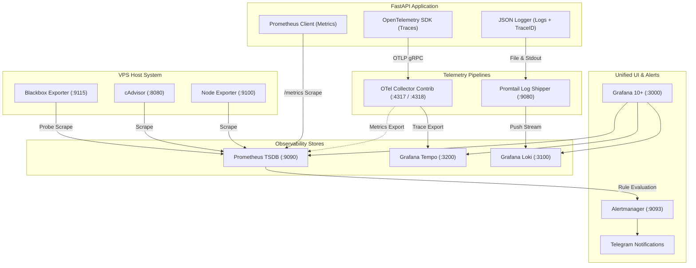

# System Architecture & Telemetry Pipeline Design

## 1. Overview & Core Philosophy
This platform delivers a production-grade, end-to-end observability and security engine engineered for modern web applications and cloud infrastructure. It provides unified visibility across:
1. **Infrastructure Layer**: Host hardware metrics, kernel load, disk I/O, network interfaces, and container lifecycles.
2. **Application Performance Monitoring (APM)**: Golden signals (Traffic, Latency, Errors, Saturation), route-level latency distributions, database query performance, and external API latency.
3. **Business & Usage Layer**: Real-time active users by subscription tier, checkout & revenue throughput, user signups, API token quotas, and feature consumption.
4. **Security & Threat Defense**: Brute-force authentication monitoring, rate limit violators, vulnerability scans, and Fail2ban integration with instant Telegram alerting.

---

## 2. Telemetry Ingestion Pipelines

---

## 3. Distributed Tracing & Log Correlation
Every incoming HTTP request is assigned a unique W3C `traceparent` context and `X-Request-ID`. 
When FastAPI services handle requests, all sub-operations (database queries, external API calls, cache queries) create child spans attached to the parent trace.

Structured JSON logs automatically capture the active `trace_id` and `span_id`. In Grafana:
- Viewing a log line in **Loki** displays a clickable `TraceID` link that opens the exact trace execution graph in **Tempo**.
- Inspecting a trace in **Tempo** displays a `Traces to Logs` tab that instantly pulls all associated server logs from **Loki**.

---

## 4. Metrics Cardinality & Performance Strategy
To maintain low memory footprint and high query performance:
1. **Route Normalization**: Raw paths (e.g. `/api/feature/export_csv`) are mapped to templated routes (`/api/feature/{feature_name}`).
2. **Prometheus TSDB Compaction**: Blocks are compressed using snappy chunk encodings with automatic 30-day retention pruning.
3. **Recording Rules**: Frequently queried metrics (p95/p99 percentiles, error rate ratios) are pre-aggregated every 15s to ensure instantaneous Grafana dashboard loading under heavy load.
