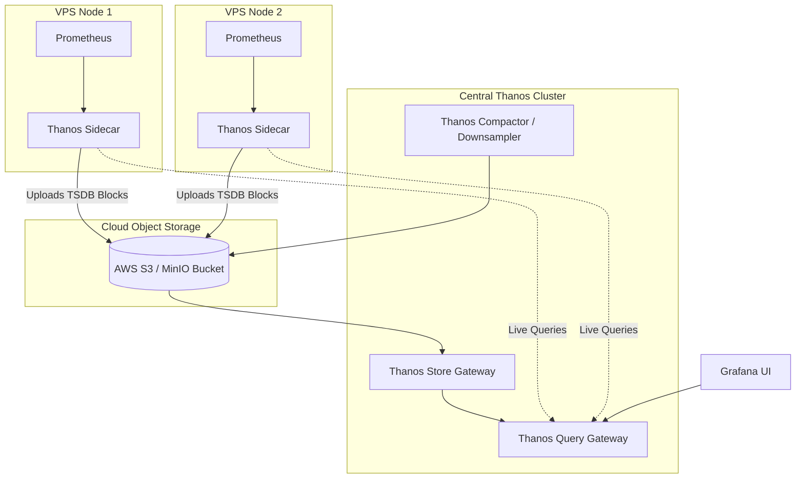

# Scaling Roadmap: 1 VPS to 100+ Nodes

This document provides the SRE engineering roadmap for scaling this observability platform as your infrastructure grows from a single VPS to large multi-node clusters.

---

## 1. Growth Stage Matrix

| Stage | Infrastructure Size | RPS Range | Recommended Architecture | Storage Strategy |
| :--- | :--- | :--- | :--- | :--- |
| **Stage 1 (Current)** | 1 – 3 VPS Nodes | 0 – 5,000 | Monolithic Docker Stack (Single Prometheus + Loki TSDB + Tempo) | Local NVMe SSD Volumes (30d retention) |
| **Stage 2** | 4 – 15 VPS Nodes | 5,000 – 25,000 | Edge Exporters + Central Prometheus Server / Federation | Local TSDB + S3 Backup |
| **Stage 3** | 16 – 50 VPS Nodes | 25,000 – 100,000 | Thanos Architecture (Sidecars on each VPS + Thanos Query + Store) | Object Storage (AWS S3 / MinIO / Backblaze B2) |
| **Stage 4** | 50 – 200+ VPS Nodes | 100,000+ | Distributed Microservices: Grafana Mimir + Loki SimpleScalable + Tempo S3 | Tiered Hot/Cold Object Storage + Multi-Tenant Quotas |

---

## 2. Multi-VPS Federation & Remote Write (Stage 2)

```
[ Edge VPS 1: Node + App ] ---\
[ Edge VPS 2: Node + App ] ----+---> [ Central Monitoring VPS ]
[ Edge VPS 3: Node + App ] ---/      ├── Prometheus (Central Aggregator)
                                     ├── Loki (Log Ingestion Gateway)
                                     ├── Tempo (Trace Ingestion)
                                     └── Grafana (Single Pane of Glass)
```

### Configuration:
On Edge VPS nodes, run only lightweight exporters:
- Node Exporter (`:9100`)
- cAdvisor (`:8080`)
- Promtail (pushing logs over TLS to Central Loki)
- FastAPI (pushing OTLP traces to Central OTel Collector)

On Central Prometheus, scrape remote targets using secure WireGuard / Tailscale VPN IPs or mutual TLS (mTLS).

---

## 3. Enterprise Thanos Architecture (Stage 3 & 4)

When metrics exceed 500,000 active time-series or multi-year retention is needed:



### Benefits:
1. **Global Query View**: Queries across 100+ Prometheus instances with automatic deduplication.
2. **Infinite Retention**: Historical TSDB blocks are compressed and stored in cost-effective S3/MinIO buckets ($0.005/GB/mo).
3. **Downsampling**: Automatic 5m and 1h metric rollups for fast multi-year trend queries.

---

## 4. Loki Log Retention & Object Storage
To scale logs beyond 50GB/day:
- Configure `loki.yml` storage to use `aws` / `s3` or `minio` object store.
- Enable automatic compaction to downscale indices and enforce 90-day retention policies without disk exhaustion.
